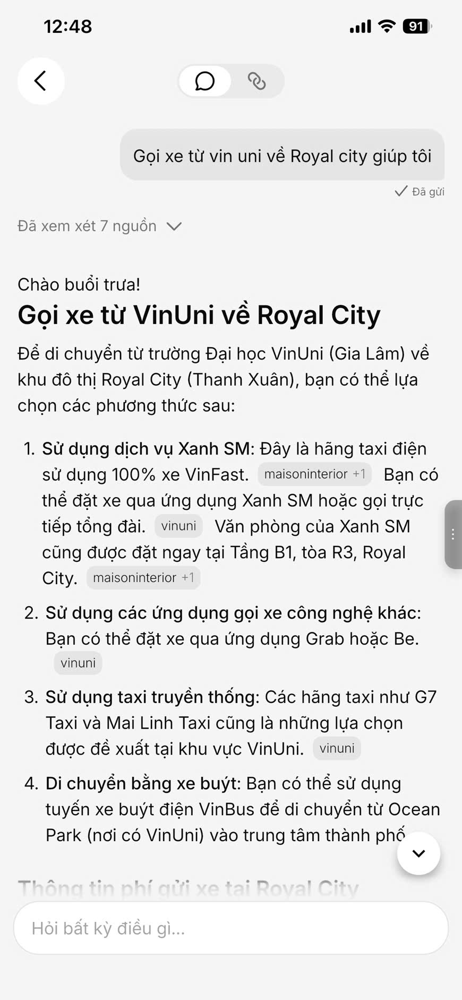
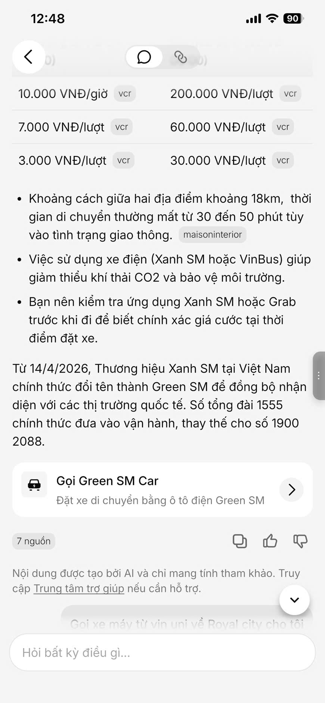
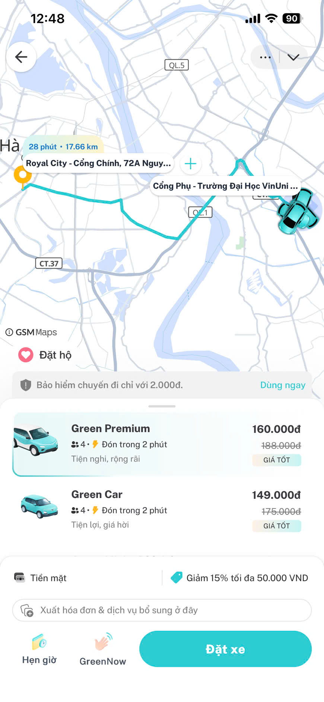

# App Teardown — V-AI

## 1. App selected
Tôi chọn: V-AI + Tính năng Hỗ trợ đổi xe Vinfast

## 2. Promise vs Reality

### Product hứa gì?

V-App hứa giúp người dùng **đặt xe ngay trong ứng dụng** thông qua V-AI. Thay vì phải tự tìm chức năng đặt xe, user có thể nhập hoặc nói nhu cầu di chuyển và được AI hỗ trợ dẫn đến bước đặt xe phù hợp.

### User nào được giúp?

Nhóm user chính là **người dùng V-App có nhu cầu đặt xe nhanh**, đặc biệt là những người muốn dùng AI để thao tác nhanh hơn trong app.

Ví dụ:
- Người cần đặt xe đi học, đi làm, về nhà.
- Người không muốn tự tìm từng nút chức năng trong app.
- Người kỳ vọng AI hiểu câu lệnh tự nhiên như “đặt xe cho tôi” hoặc “tôi muốn gọi xe”.

### Kỳ vọng của tôi

Tôi kỳ vọng AI có thể:

- Hiểu được user đang muốn đặt xe.
- Hỏi lại các thông tin còn thiếu như điểm đón, điểm đến và loại xe.
- Phân biệt được user muốn đặt **ô tô** hay **xe máy** trước khi chuyển sang bước đặt xe.

### Thực tế khi dùng

Input/prompt tôi thử:

> “Đặt xe cho tôi”

Observation:

Khi tôi chỉ nhập nhu cầu đặt xe chung chung, chatbot/V-AI nhận định ngay là tôi muốn đặt **ô tô**. AI không hỏi lại xem tôi muốn đặt **ô tô hay xe máy**.

Đây là điểm gãy trong flow vì câu “đặt xe” vẫn còn mơ hồ. User có thể muốn đặt xe máy vì nhanh hơn, rẻ hơn hoặc phù hợp với quãng đường ngắn. Tuy nhiên, AI lại tự mặc định là ô tô mà không xác nhận lại nhu cầu.

Điểm gãy này thuộc layer **Intent + UX Recovery**, vì AI chưa xử lý tốt trường hợp thiếu thông tin và chưa có bước hỏi lại khi intent chưa rõ.

Evidence:

- Hành vi quan sát được: V-AI tự chuyển hướng/hiểu intent sang đặt ô tô.
- Screenshot: 

- 

- 

- 

## 3. Four Paths

| Path | Quan sát |
|---|---|
| Happy path | Khi user nhập rõ yêu cầu, ví dụ: “Đặt ô tô cho tôi từ nhà đến trường”, AI hiểu đúng nhu cầu đặt **ô tô**, sau đó dẫn user sang flow đặt xe phù hợp. User có thể tiếp tục nhập điểm đón, điểm đến và xác nhận chuyến đi. |
| Low-confidence path | Khi user chỉ nhập chung chung: “Đặt xe cho tôi”, AI đáng ra cần nhận ra thông tin còn thiếu vì chưa biết user muốn **ô tô hay xe máy**. Tuy nhiên, trong thực tế AI không hỏi lại mà tự mặc định là đặt ô tô. |
| Failure path | Tính năng này không bị fail. |
| Correction path | Khi user sửa lại bằng cách nói rõ hơn, ví dụ: “Không, tôi muốn đặt xe máy”, AI có thể tiếp tục xử lý lại yêu cầu. Tuy nhiên, app chưa thể hiện rõ việc correction này được lưu lại, dùng để cải thiện intent detection, hoặc tránh lặp lại lỗi tương tự trong lần sau. |

## 4. Finding → Product Decision

Khi user nhập yêu cầu chung chung như **“Đặt xe cho tôi”**,  
AI/product tự mặc định user muốn đặt **ô tô** mà không hỏi lại loại xe,  
hậu quả là user có thể bị chuyển sang flow không đúng nhu cầu nếu họ thực ra muốn đặt **xe máy**. Điều này làm user mất thời gian quay lại, sửa câu lệnh hoặc thao tác thủ công.

Lỗi thuộc layer **Intent + UX Recovery**.

Nên sửa bằng **requirement + UX fallback**: khi intent là “đặt xe” nhưng loại xe chưa rõ, V-AI cần hỏi lại user muốn đặt **ô tô hay xe máy** trước khi chuyển sang flow đặt xe.

---

## 5. As-is / To-be Sketch

### As-is

User nhập: “Đặt xe cho tôi”  
↓  
V-AI hiểu intent là đặt xe  
↓  
V-AI tự mặc định loại xe là ô tô  
↓  
App chuyển user sang flow đặt ô tô  
↓  
Nếu user muốn xe máy, user phải quay lại hoặc nhập lại yêu cầu  

### To-be

User nhập: “Đặt xe cho tôi”  
↓  
V-AI hiểu intent là đặt xe  
↓  
V-AI phát hiện thiếu thông tin loại xe  
↓  
V-AI hỏi lại: “Bạn muốn đặt ô tô hay xe máy?”  
↓  
User chọn ô tô hoặc xe máy  
↓  
App chuyển user sang đúng flow đặt xe tương ứng  

---

## 6. SPEC Change

Finding này sẽ đổi SPEC bằng cách:

Bổ sung requirement rằng: **khi user có intent “đặt xe” nhưng chưa nói rõ loại xe, V-AI không được tự mặc định là ô tô; thay vào đó, V-AI phải hỏi lại user muốn đặt ô tô hay xe máy trước khi tiếp tục flow đặt xe.**